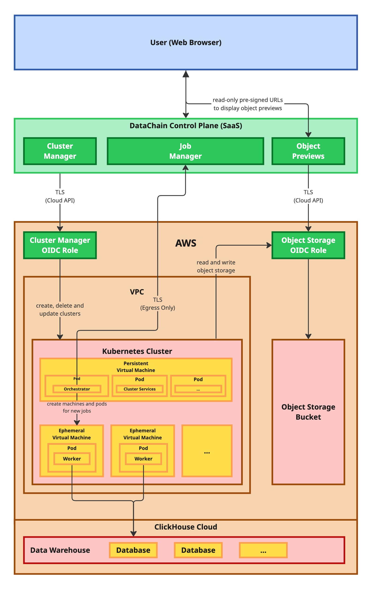

# Supporting infrastructure for DataChain Compute Clusters

## Overview

### 1. **Networking**
- **VPC (`aws_vpc.datachain_cluster`)**: A Virtual Private Cloud with CIDR block `172.18.0.0/16` to isolate the compute cluster.
- **Subnets (`aws_subnet.datachain_cluster`)**: Public subnets are created in all available availability zones to ensure high availability.
- **Internet Gateway (`aws_internet_gateway.datachain_cluster`)**: Provides internet access for resources within the VPC.
- **Route Table (`aws_route_table.datachain_cluster`)**: Configures routing for internet-bound traffic through the Internet Gateway.
- **Security Group (`aws_security_group.datachain_cluster`)**: Controls inbound and outbound traffic for the cluster, allowing all traffic within the VPC and outbound traffic to the internet.

### 2. **IAM Roles and Policies**
- **Cluster Role (`aws_iam_role.datachain_cluster`)**: Assumed by the EKS cluster to manage AWS resources.
- **Node Role (`aws_iam_role.datachain_cluster_node`)**: Assumed by EC2 instances (worker nodes) in the cluster.
- **Pod Role (`aws_iam_role.datachain_cluster_pod`)**: Assumed by EKS pods for accessing AWS resources.
- **OIDC Compute Role (`aws_iam_role.datachain_oidc_compute`)**: Assumed by DataChain Studio (SaaS) to create, delete and manage DataChain clusters.
- **OIDC Storage Role (`aws_iam_role.datachain_oidc_storage`)**: Assumed by DataChain Studio (SaaS) to read and write object storage (S3) buckets.

### 3. **OpenID Connect (OIDC)**
- **OIDC Provider (`aws_iam_openid_connect_provider.datachain_oidc`)**: Configures an OIDC provider for the cluster, enabling secure authentication for pods.

### 4. **Outputs**
- VPC ID (`datachain_cluster_vpc_id`)
- Subnet IDs (`datachain_cluster_subnet_ids`)
- Security Group IDs (`datachain_cluster_security_group_ids`)
- IAM Role ARNs for the cluster, nodes, and OIDC roles.

## Security Considerations

1. **IAM Policies**: The roles are attached to AWS-managed policies to ensure least privilege access, and restrict allowed actions to DataChain-managed resources.

2. **OIDC Integration**: The use of OIDC allows DataChain Studio to securely manage cloud resources in the target account eliminating the need for static credentials.

3. **Network Isolation**: The VPC and security groups ensure that the cluster is isolated from external networks, with controlled ingress and egress rules.

# Architecture overview for DataChain Compute Clusters



DataChain Studio is split into 2 main components:

* Control Plane — typically hosted by us as a fully managed service
* Compute & Data Plane — typically hosted on your cloud accounts

Compute resources will be provisioned through managed Kubernetes clusters we automatically deploy on your account, using the permissions described in this repository.

# Guidance

# Granting Access to AWS Secrets in DataChain Studio Jobs

You can securely inject sensitive configuration (such as tokens, passwords, or private URLs) into your compute jobs by referencing AWS Secrets Manager secrets through environment variables. This avoids hardcoding credentials and allows fine-grained secret management.

## How to Use

1. **Create a JSON Secret in AWS Secrets Manager**

   Store your secret as a JSON object. For example:

   ```json
   {
     "EXAMPLE_SECRET": "your-secret-value-or-url"
   }
   ```

2. **Set an Environment Variable in the Studio Job Settings**

   In DataChain Studio, configure your job with an environment variable that references the secret using the special `aws://` syntax:

   ```
   EXAMPLE_SECRET=aws://arn:aws:secretsmanager:us-east-1:000000000000:secret:example-secret/test-abcdef#EXAMPLE_SECRET
   ```

   - Replace `arn:aws:secretsmanager:us-east-1:000000000000:secret:example-secret/test-abcdef` with the full ARN of your secret.
   - The part after the `#` (e.g., `#EXAMPLE_SECRET`) refers to the key in your JSON secret.
   - Add the full ARN of your secret to `variables.tf`
